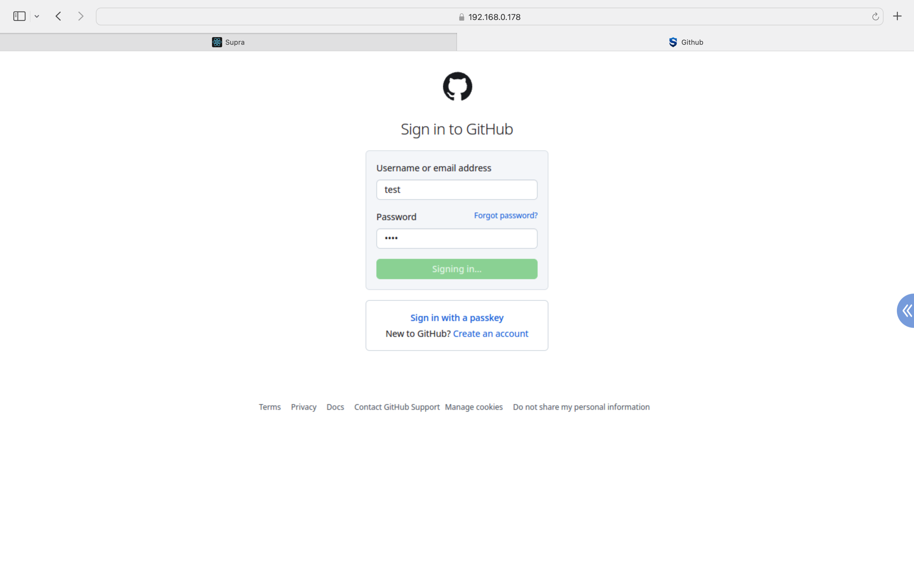

SupraRBI-HTTPS is a Remote Browser Isolation (RBI) solution with web/https front end, based on [guacamole-server](https://github.com/apache/guacamole-server) and [SupraRBI-VNC](https://github.com/supraaxes/suprarbi-vnc) with docker.

## Usage
SupraRBI-HTTPS provides a web portal for direct user access and an API for integration with network/security solutions (e.g. gateway, proxy).
```
sudo docker compose up -d
```
### Web Portal
SupraRBI-HTTPS Web Portal lists all resources provided by the administration, organized by groups. When a user accesses SupraRBI-HTTPS Web Portal with a browser, each time she clicks the icon of a resource, a corresponding RBI session will be presented in a new tab.

<div style="display: flex;">
    
    
</div>

### API
Each time the SupraRBI-HTTPS server gets a valid RBI request, it will respond with Status Code 302 and a URL for the corresponding RBI session. End users can access the RBI seesion from a browser with the URL. 

Please check [API specification](/api.yml) for detailed info.

## Installation
SupraRBI-HTTPS is built with Service-Oriented Architecture (SOA) on docker, with mounts to the host for persistant storage (cofigurations, logs, icons.) and cross-service sharing (temp files for user uploads).

### Mounts 
1. **Tmp, /opt/supra/rbi/data/temp/**: temp files for user uploads<br>
2. **Logs, /opt/supra/rbi/logs/**: log files <br>
3. **Certificate, /opt/supra/rbi/cert**: certificate(tls.cert) and key(tls.key) for HTTPS. If not provided, a self-signed certificate and key will be automatically generated.<br>
4. **Configs, /opt/supra/rbi/conf/**: configuration files<br>
    - **Token**, tokens.json: list of strings as valid tokens. Each API request for a RBI seesion MUST have a valid token.<br>
    - **Policy**, policy/: file name as policy name (*.json), with settings inside. Each resource in resource.json or each API request for a RBI seesion SHOULD specify the name of a policy to be enforced, and if not specified, the default policy defined by default.json will be used.<br>
    - **Resource**, resource.json: list of resources in Web Portal.<br>
    - **license**, license.json: license file for [projector-supra-web](https://github.com/SupraAXES/projector-supra-web) when used.
    - **Autofill**, autofill/: file name as site name (*.json) for autofill with [projector-supra-web](https://github.com/SupraAXES/projector-supra-web), please check [Autofill with SupraRBI-VNC](https://github.com/SupraAXES/projector-supra-web?tab=readme-ov-file#json-file-with-autofill-settings) for detailed info. <br>
    - **Guacd**, guacd_settings.conf: optional file with default settings for guacd, please check [VNC Settings for Guacamole](https://guacamole.apache.org/doc/gug/configuring-guacamole.html#vnc) for detailed info.
5. **Icons, /opt/supra/rbi/icons/**: icon files for resources in Web Portal, specified in resource.json for each resource.<br>

### Modules/Images 
- **rbi-portal**: web/https front end with Nginx.
- **rbi-admin**: app server with Java.
- **resc-agent**: [guacamole-server](https://github.com/apache/guacamole-server) for VNC connections to [SupraRBI-VNC](https://github.com/supraaxes/suprarbi-vnc) server. <br>
*Note*: the official guacamole/guacd image has [an issue with auto resize](https://github.com/SupraAXES/SupraRBI-VNC/blob/main/resources/guacamole.md#auto-resize-to-vnc-sessions), and it is recommanded to use supraaxes/supra-guacd image customized by [SupraAXES Inc.](https://www.supraaxes.com) before the issue is officially fixed.
- **vnc-rbi**:  [SupraRBI-VNC](https://github.com/supraaxes/suprarbi-vnc) server.
- **projector-chrome**: [open-source projector image](https://github.com/SupraAXES/projector-chrome) with Chrome in kiosk mode. 
- **projector-supra-web**: [customized projector image](https://github.com/SupraAXES/projector-supra-web) from [SupraAXES Inc.](https://www.supraaxes.com)
